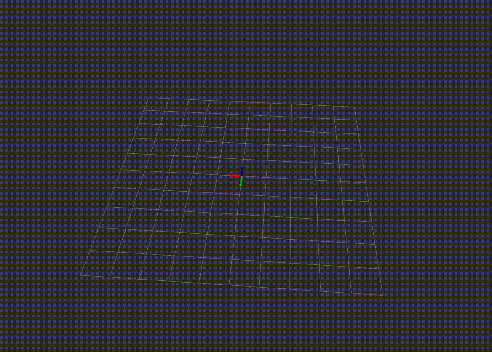

# Workspace about IMU

- [Workspace about IMU](#workspace-about-imu)
  - [Introduction](#introduction)
  - [Quick Start](#quick-start)
    - [1. Download & Build](#1-download--build)
    - [2. Read Sensor Data(Only for Xsens Mti series)](#2-read-sensor-dataonly-for-xsens-mti-series)
    - [3. Display Odom of IMU by directly discrete integral](#3-display-odom-of-imu-by-directly-discrete-integral)
      - [a. Configure the yaml file](#a-configure-the-yaml-file)
      - [b. Run it](#b-run-it)
      - [c. Result demo](#c-result-demo)
    - [4. Calibrate the noise and random walk noise of bias](#4-calibrate-the-noise-and-random-walk-noise-of-bias)
## Introduction

Function 1: Provide ROS drivers for Xsens Mti series.

Function 2: Generate odometry message by median discrete integral of  IMU data.

Function 3: Calibrate the noise and random walk noise of bias of IMU.

## Quick Start

### 1. Download & Build

```bash
git clone --recursive https://github.com/yanliang-wang/imu_ws.git
```

Modify `imu_ws/src/code_utils/src/sumpixel_test.cpp`: `#include "backward.hpp"` --> `#include “code_utils/backward.hpp”`

```bash
catkin_make -DCATKIN_WHITELIST_PACKAGES="code_utils"

catkin_make -DCATKIN_WHITELIST_PACKAGES=""
```

### 2. Read Sensor Data(Only for Xsens Mti series)

```bash
roslaunch imu_odom read_data.launch  
```

### 3. Display Odom of IMU by directly discrete integral

#### a. Configure the yaml file 

Modify `imu_ws/src/imu_odom/config/test.yaml`

```yaml
imu_odom:
  {
    hz: 200,					# the rate of odom published
    g_vec: [0.0, 0.0, -9.81],	# the gravity vector relative to initial frame
    enable_position: false,		# enable display of position of odom
    sub_imu_topic: /imu/data,	# the topic name of IMU to subscribe
    pub_odom_topic: /imu/odom	# the topic name of Odom to publish
  }
```

#### b. Run it

```bash
roslaunch imu_odom test.launch
```

#### c. Result demo

- Orientation change with low drift.


- Position change with high drift( IMU is stationary in this case ).



### 4. Calibrate the noise and random walk noise of bias

Refer to [imu_utils](https://github.com/gaowenliang/imu_utils).

Step:

- collect the data while the IMU is Stationary, with a two hours duration, **at least two hours** suggested;
- modify the param of the launch file;

```xml
<launch>
    <node pkg="imu_utils" type="imu_an" name="imu_an" output="screen">
        <param name="imu_topic" type="string" value= "/imu/data"/>
        <param name="imu_name" type="string" value= "xsens"/>
        <param name="data_save_path" type="string" value= "$(find imu_utils)/data/"/>
        <param name="max_time_min" type="int" value= "200"/> <!-- the duration of your bag (Unit: minute) -->
        <param name="max_cluster" type="int" value= "100"/>
    </node>
</launch>
```

- roslaunch the rosnode;

```bash
roslaunch imu_utils xsens.launch
```


